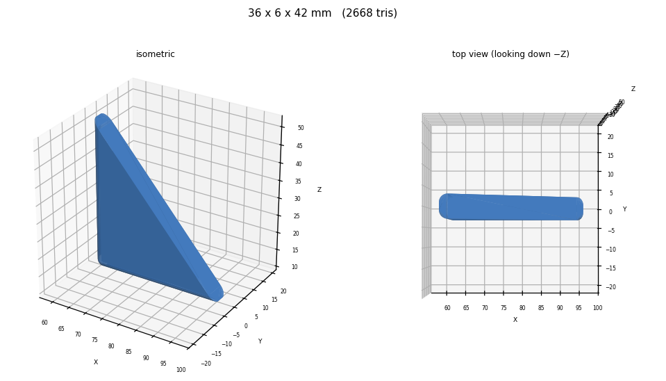
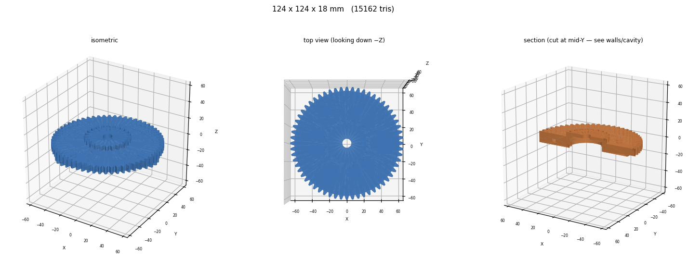
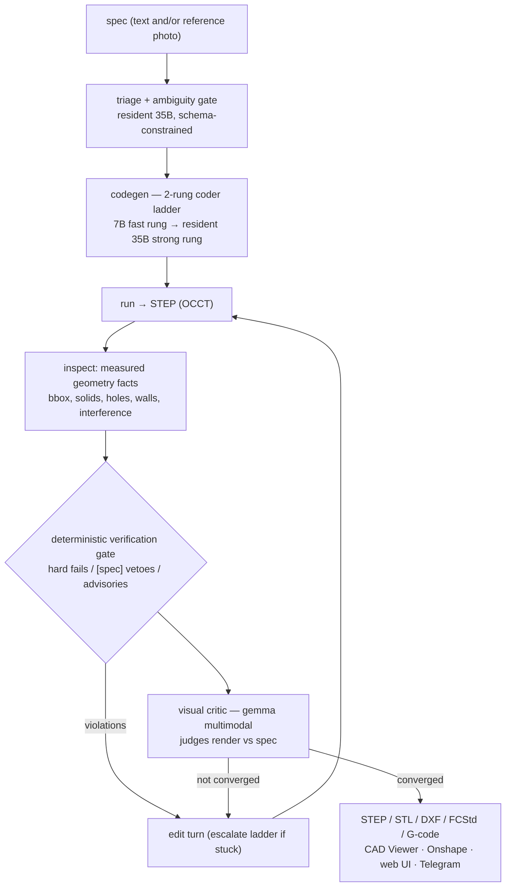

# Maker Agent

**A fully-local text-to-CAD agent: plain-English spec → verified, manufacturable part — on one 8 GB consumer GPU.**

   

The agent writes [build123d](https://github.com/gumyr/build123d) Python, executes it, **measures the resulting geometry**, renders it, has a multimodal critic judge it against the spec, and edits until it converges — an observe–edit loop where a deterministic verification gate, not the LLM, decides whether a part is acceptable. Everything runs on a single AMD RX 6600 (8 GB VRAM, ROCm/Vulkan): a resident 35B MoE via llama.cpp plus swapped Ollama guests. No cloud calls at build time.

The project's operating rule is **measure, don't claim**: every capability ships with an A/B benchmark, and negative results are kept in the record alongside the wins.

## Measured results

| Finding | Numbers | Where |
|---|---|---|
| Best-of-N first-turn sampling (N=3) doubles acceptance **and** cuts wall time | 5/22 → **10/22** accepted, suite time 2097 s → **1221 s** (same engine both legs) | `benchmarks/results/run_20260719_*.json` |
| Engine scaffolding is worth ~3× to a small coder | same 7B model: **13/22** in the full loop vs 4/22 pipeline-only vs 0/22 bare | model-refresh A/B, 2026-07-17 |
| Few-shot retrieval lifts a code-specialist +23 pts, generalist +0 | qwen2.5-coder-7B: 4/22 → **13/22** with retrieved examples; qwen3-8B flat | 2×2 A/B, 2026-07-17 |
| Removing the LLM "brief" planning stage *helped* the local 7B | tiers 1–2 convergence **3/6 → 6/6** | brief A/B, 2026-07-30 |
| Deterministic gate vs. blind human CAD review | agreement **9/11** after adding interference/assembly checks (was 6/11) | gate overhaul, 2026-07-30 |
| QLoRA fine-tune (369 verified teacher pairs) honestly evaluated | FT 5/10 vs stock 6/10 → **no-ship; stock model kept its place** | `docs/RUNPOD_RUNBOOK.md`, `logs/ft_*.log` |
| Strong-rung suite (30B-class coder, 10-part suite) | 6–7/10 converged, 21–22/31 acceptance checks | `benchmarks/results/showcase_30b_full.json` |

## What a build looks like

Renders are the agent's own two-panel observation (isometric + top-down, plus a section cut when internal geometry matters) — the same images the visual critic sees each turn.

| | |
|---|---|
|  |  |

More in [`benchmarks/results/artifacts/`](benchmarks/results/artifacts/) — every benchmark run persists its STEP files, renders, and per-part gate verdicts.

## Architecture



Key design decisions, each with its measurement in [`docs/PROJECT.md`](docs/PROJECT.md):

- **Deterministic verification gate** — the geometry is *measured* after every turn (bounding box, hole counts and spacing, wall thickness, part interference, assembly gaps). Checks derived from the user's own words (`[spec]` checks) can veto an accept; the LLM never grades its own work. Discipline adapted from [earthtojake/text-to-cad](https://github.com/earthtojake/text-to-cad).
- **Two-rung coder ladder** — a fast 7B specialist handles most parts; triage or repeated failure escalates to a resident 35B MoE (llama.cpp Vulkan, CPU-resident experts). A 14B middle rung was benchmarked and **removed** — it was slower than the big MoE and weaker than the 7B.
- **Learning loop, A/B-verified** — converged builds are harvested as few-shot examples and SFT pairs ([GIFT](https://arxiv.org/abs/2603.27448)-style, including failure→fix pairs); retrieval is injected as *technique references, not copy targets*, and can be disabled per-run (`--no-fewshots`) so the lift stays measurable.
- **The human is the final gate** — the agent always ships its artifacts, even on a failed gate; honesty constrains the *claim*, never the output. Accepted parts still go through a human review queue before becoming training data.
- **CAM back-ends** — validated 3D-print G-code (OrcaSlicer, deterministic motion checks), kerf-compensated laser DXF, and headless FreeCAD 2.5D CNC toolpaths re-verified against measured hole centres.

## Quick start

Requires Python 3.10+, [Ollama](https://ollama.com), and the build123d stack (`pip install build123d`). Models: a small coder (e.g. `qwen2.5-coder:7b-instruct-q4_K_M`), a multimodal critic (`gemma4:e4b`-class), `nomic-embed-text` for retrieval, and optionally a 30B+ strong rung served by llama.cpp.

```bash
git clone https://github.com/Anthonyhangprinter/maker-agent
cd maker-agent

# one-shot build, machine-readable output
python3 cad_engine.py build "a 100x60x30mm enclosure with 2mm walls" --json

# interactive describe → build → refine → undo loop
python3 -m cad_v5 "a bracket with 4x M3 holes on a 40mm bolt circle"

# image-conditioned build (reference photo → vision pre-pass → spec)
python3 -m cad_v5 --image photo.jpg "a bracket like this, 80mm long"

# run the benchmark suite
python3 scripts/run_benchmarks.py --suite text-to-cad
```

Model names, timeouts, and loop constants are single-sourced in `cad_v5/config.py`; per-machine settings (coder pin, output targets) live in `~/.openclaw/cad.json`. Frontends included: CLI, FastAPI web UI (`webui/`), and a Telegram bot (`integration/`).

**Prompting rubric — the 4 S's:** Size (envelope, mm), Specs (counts + diameters, "4x M3"), Surfaces (which face), Symmetry (patterns/spacing). Named hardware (M3, 608ZZ bearing, W200 I-beam) is understood as-is and built by correct-by-construction helpers that bypass the LLM entirely.

## Research notes

The `docs/` directory is the research record, written as the work happened:

- [`PROJECT.md`](docs/PROJECT.md) — design and measured results for every milestone
- [`ROADMAP.md`](docs/ROADMAP.md) / [`DIRECTION.md`](docs/DIRECTION.md) — where this is going and why
- [`BUILDS.md`](docs/BUILDS.md) — build journal
- [`RUNPOD_RUNBOOK.md`](docs/RUNPOD_RUNBOOK.md) — the QLoRA fine-tune campaign, end to end
- [`CADAM-REFERENCE.md`](docs/CADAM-REFERENCE.md) — study notes on AdamCAD/CADAM (patterns ported, no GPL code)

**Negative results, kept on purpose:** a pseudo-OpenSCAD intermediate representation (0/6, rejected); the 14B coder rung (measured out twice); a 369-pair QLoRA fine-tune that became 100% reliable on easy tiers but lost the stock model's occasional hard-tier wins (no-ship); an LLM "brief" planning stage that a measurement showed was *hurting* the small coder (retired, one config flag restores it).

## Acknowledgments

Built on [build123d](https://github.com/gumyr/build123d) and [bd_warehouse](https://github.com/gumyr/bd_warehouse) (gumyr). Verification-gate discipline from [earthtojake/text-to-cad](https://github.com/earthtojake/text-to-cad). Best-of-N sampling and SFT-pair harvesting adapted from [GIFT (arXiv:2603.27448)](https://arxiv.org/abs/2603.27448). UI/workflow patterns studied from AdamCAD's CADAM and Tsinghua IEI Lab's [Multi-Agent-CAD](https://github.com/Pan-Chera/Multi-Agent-CAD).

## Citation

```bibtex
@software{romanelli2026makeragent,
  author  = {Romanelli, Anthony},
  title   = {Maker Agent: a local-first text-to-CAD agent with a measured learning loop},
  year    = {2026},
  url     = {https://github.com/Anthonyhangprinter/maker-agent}
}
```

## License

[MIT](LICENSE)
